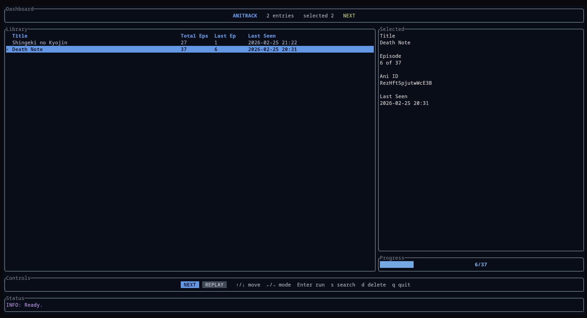

# anitrack

[](https://github.com/MiguelRegueiro/anitrack-cli/actions/workflows/ci.yml)
[](https://docs.rs/crate/anitrack/latest)
[](https://aur.archlinux.org/packages/anitrack-bin)

AniTrack is a companion CLI for `ani-cli`. It adds watch-progress tracking and navigation while delegating search and playback to `ani-cli`.
It does not replace `ani-cli`; it orchestrates and extends that workflow.

## Screenshot


## Platform Support
| Platform | Status | Notes |
| --- | --- | --- |
| Linux | Supported | Primary target; manually tested and covered by CI. |
| macOS | Conditionally supported | CI integration-harness tested. Runtime depends on `ani-cli` and its macOS dependencies. Not yet manually tested on a physical macOS system by the maintainer. |
| Windows | Experimental | CI verifies build/tests and integration harness scenarios on `windows-latest`; full end-to-end behavior still depends on `ani-cli` runtime ecosystem on each machine. |

## Requirements
- `ani-cli` installed and available on your `PATH`
- Linux-only optional enhancement: `journalctl` (used as a fallback signal when history content is unchanged)
- For macOS dependency setup (`curl`, `grep`, `aria2`, `ffmpeg`, `git`, `fzf`, `yt-dlp`, and player integration), follow the upstream `ani-cli` install guidance: <https://github.com/pystardust/ani-cli>

## Installation

### Arch Linux (AUR)
Recommended (prebuilt binary, no Rust toolchain required):
```bash
paru -S anitrack-bin
```

Source build (Rust toolchain required only while building):
```bash
paru -S anitrack
```

Both AUR packages declare `ani-cli` as a dependency, so it is installed automatically if missing.
Equivalent `yay` commands also work if you use `yay` instead of `paru`.

### crates.io (any distro with Rust)
Install from crates.io:
```bash
cargo install anitrack
```

This method does not install [`ani-cli`](https://github.com/pystardust/ani-cli), so install `ani-cli` separately and ensure it is on your `PATH`.

Verify installation:
```bash
anitrack --version
```

Upgrade to the latest release (crates.io):
```bash
cargo install anitrack --force
```

### Troubleshooting (Arch)
If `paru -S anitrack` fails to build on your system, install the prebuilt package instead:
```bash
paru -S anitrack-bin
```

### Uninstall
AUR:
```bash
paru -Rns anitrack-bin
# or
paru -Rns anitrack
```

crates.io:
```bash
cargo uninstall anitrack
```

## Quick Start
```bash
anitrack
anitrack start
anitrack next
anitrack replay
anitrack list
```

Detailed usage, command behavior, keybindings, data paths, and runtime notes are documented in [docs/usage.md](docs/usage.md).

<details>
<summary><strong>Run From Source (Development)</strong></summary>

For local development, run from the repository root:

```bash
cargo run
cargo run -- start
cargo run -- next
cargo run -- replay
cargo run -- list
cargo run -- tui
```

</details>

## License
This project is licensed under the GNU General Public License v3.0 or later (`GPL-3.0-or-later`).
See [LICENSE](LICENSE).

## Changelog
See [CHANGELOG.md](CHANGELOG.md) for release history and notable changes.
