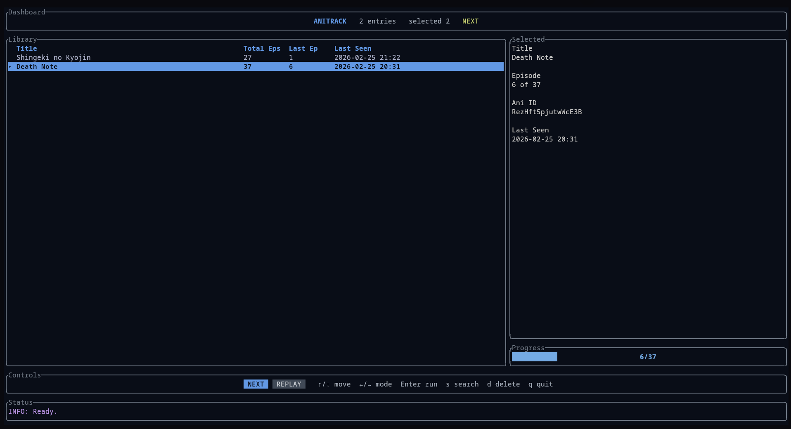

# anitrack

[](https://github.com/MiguelRegueiro/anitrack-cli/actions/workflows/ci.yml)
[](https://crates.io/crates/anitrack)
[](https://aur.archlinux.org/packages/anitrack-bin)

Track your [`ani-cli`](https://github.com/pystardust/ani-cli) watch progress and manage watched shows from a simple TUI.



## Features

- **Automatic progress tracking** — records the show and final episode reached after successful playback
- **Library TUI** — browse tracked shows and launch actions without leaving the terminal
- **Playback controls** — continue, replay, go to the previous episode, or select an episode
- **Integrated search** — open `ani-cli` search from the TUI and sync the result
- **Dub mode** — pass dubbed playback and search through to `ani-cli`
- **Safe updates** — failed or interrupted playback does not overwrite saved progress

---

## Installation

anitrack requires `ani-cli` to be installed and available on your `PATH`.

### Arch Linux

Install the prebuilt package:

```bash
paru -S anitrack-bin
```

Or build from source through the AUR:

```bash
paru -S anitrack
```

Both packages install `ani-cli` automatically. The equivalent `yay` commands also work.

### Cargo

```bash
cargo install anitrack
```

The Cargo package does not install `ani-cli`; follow the [`ani-cli` installation instructions](https://github.com/pystardust/ani-cli#installation).

---

## Usage

| Command | Description |
|---|---|
| `anitrack` | Open the TUI |
| `anitrack start` | Search with `ani-cli`, play a show, and track the result |
| `anitrack next` | Continue the most recently watched show |
| `anitrack replay` | Replay its saved episode |
| `anitrack list` | List tracked shows, newest first |

Add `--dub` before or after a subcommand for dubbed playback and search:

```bash
anitrack --dub start
anitrack next --dub
```

Use `--vlc` the same way to forward ani-cli's VLC player flag:

```bash
anitrack --vlc start
anitrack next --vlc
```

Custom ani-cli player preferences, such as `ANI_CLI_PLAYER`, are still handled by ani-cli and inherited by anitrack.

In the TUI, use `↑` / `↓` or the mouse wheel to choose a show, `←` / `→` to choose an action, and `Enter` to run it. Press `s` to search, `d` to delete, or `q` to quit.

Linux is the primary target. macOS and Windows are CI-tested, but runtime support depends on `ani-cli`.

---

## Project

- See [CONTRIBUTING.md](CONTRIBUTING.md) for development and release workflows.
- See [CHANGELOG.md](CHANGELOG.md) for release history.
- Licensed under [GPL-3.0-or-later](LICENSE).
